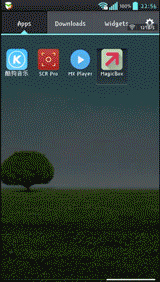

MagicBox
---

一个同时使用热修复和插件技术的app，通过特定写法写出的app既可以在魔盒app内安装，也可独立安装。

Usage
====

---

CLASS_ISPREVERIFIED的问题:

https://github.com/dodola/HotFix

https://github.com/bunnyblue/DroidFix

Javassist 使用:
https://www.ibm.com/developerworks/cn/java/j-dyn0916/

gradle commend-line:

http://stackoverflow.com/questions/29289200/in-gradle-exec-task-commandline-searching-environment-but-not-working-directory

http://blog.csdn.net/innost/article/details/48228651

使用方法:
将app-build-outputsd的app-debug.apk提取classes.dex文件，将这个文件压缩，生成一个只有代码没有资源的zip包，这个包便是补丁包，

同一个项目下生成的补丁，兼容不同的签名，debug生成的补丁也可以给release版本打补丁。

gradle知識:

全面文檔
http://tools.android.com/tech-docs/new-build-system/user-guide

資源改名
http://hugozhu.myalert.info/2014/08/03/50-use-gradle-to-customize-apk-build.html

Copyright and Licensing
----

Copyright george.yang ([my log](http://blog.csdn.net/u010499721)) © 2014-2015. All rights reserved.

This library is distributed under an MIT License.